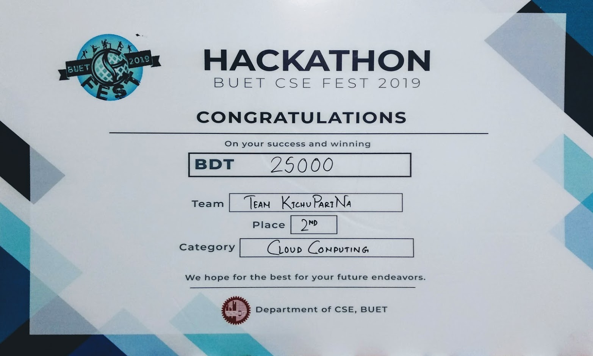

<h1>Project Intro</h1>
This project was done for BUET CSE Fest Hackathon 2019 (Cloud Computing Category). 
The problem statement for this competiton is given in this link :  
https://docs.google.com/document/d/1K6uVBqMSQfBVd4GAMON-bmuvc6BxR33hMtdUnY68k3U/edit.
 
This implementation secured 2nd position in this competition.
 
 
<h1>Project Details</h1>
This project was done using Python and various cloud APIs. A rudimentary website was designed using Django which contained user verification. The main focus was on the chatbot and we implemented all the features described in the problem statement. 
<h3> 1. Interaction with User by text and sound </h3>
A rudimentary chatbot was developed which can interact with the user through test or sound. We used Microsoft Azure cognitive services for sound recognition and appropriate responses.
<h3> 2. Capture User Image </h3>
We used openCV for image capturing
<h3> 3. Detect mood of a user </h3>
We used Face API from Microsoft Azure to detect the mood of the user from the captured photo
<h3> 4. Suggest songs from youtube based on mood </h3>
We used APIs provided by YouTube to suggest songs based on the mood detected from the aforementioned point.
<h3> 5. Show lyrics of a specific song </h3>
We used BeautifulSoup to crawl a specific website for the lyrics of a specific song described by the user.

 
 
<h1> Interactions with the ChatBot</h1>
The user must write or speak to chat with the ChatBot. In order to speak, the user must type 'Listen' on the console. If the user writes
'Play a song' then the chatbot will take a picture through the webcam and detect the mood of the user through the image. Then it will suggest YouTube songs based on the mood. If the user says 'lyrics' and then the name of a song, the chatbot will output the lyrics of that song. Saying 'quit' will end the conversation. 
 
 
<h1> Future Plans </h1>
Due to various complexities, the chatbot could't be properly integrated with the website. It will be done in due course.
 
 
<h1> The Team </h1>
Team Name : Team KichuPariNa  
Team Members :  
1. Md. Zarif Ul Alam ;  ID : 1705010  
2. Najibul Haque Sarker ;  ID : 1705044  
3. Apurba Saha ;  ID : 1705056  
 

<h1>VERDICT</h1>
We secured 2nd position in the competiton.
 

  

